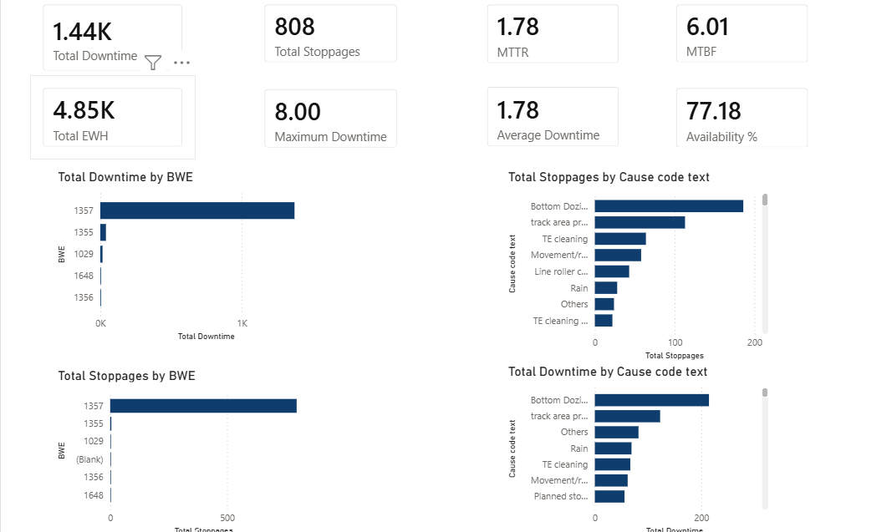
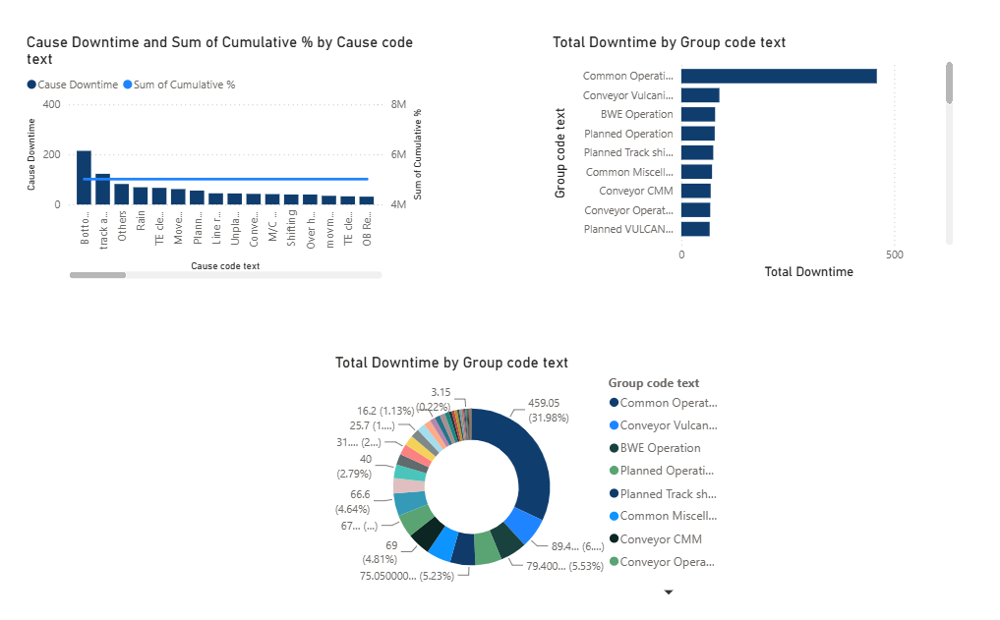
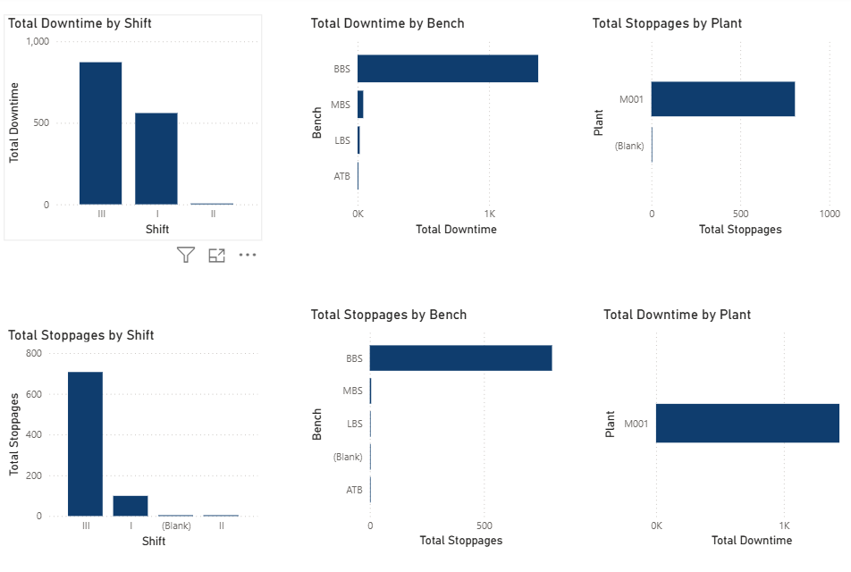
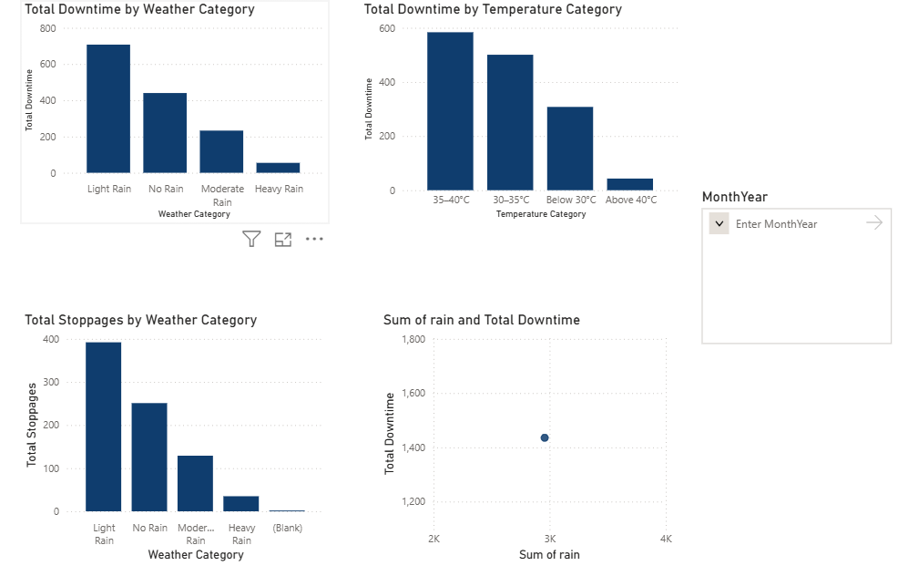
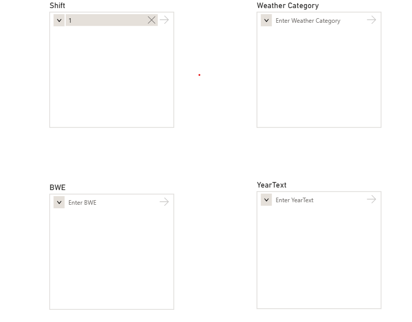
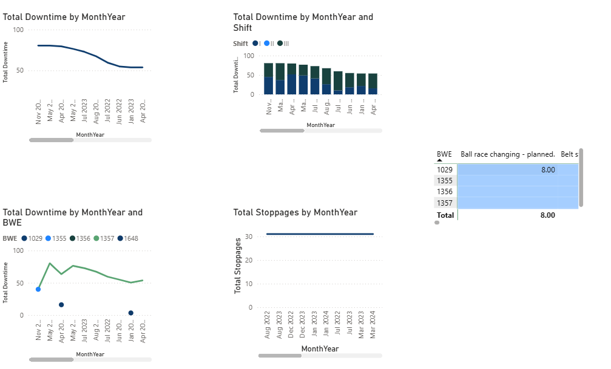

# Mine Equipment Stoppage Analysis Dashboard

## Project Overview
This project analyzes mine equipment stoppage data using Microsoft Power BI to identify downtime patterns, equipment performance, and operational efficiency.

## Objectives
  -Analyze equipment stoppages
  -Identify major downtime reasons
  -Improve equipment utilization
  -Support data-driven decision making

## Tools Used
 -Microsoft Power BI
 -Microsoft Excel

## Dashboard Screenshots

### Dashboard 1

### Dashboard 2

### Dashboard 3

### Dashboard 4

### Dashboard 5

### Dashboard 6

## Insights
  -Equipment with maximum stoppage time identified.
  -Monthly stoppage trends analyzed.
  -Downtime categorized by reason.
  -Performance comparison across equipment.
